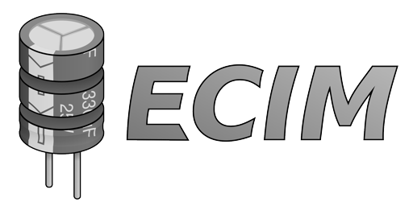

# Electronic Components Inventory Manager

## Table of Contents

* [Description](#description)
* [Build Instructions](#build-instructions)
* [Project Structure](#project-structure)
* [Testing](#testing)
* [Licenses](#licenses)

## Description

Electronic Components Inventory Manager (or ECIM for short) focuses on managing and tracking an inventory of small electronic components for hobbyists working at home. The goal is to allow users to quickly see, at a glance, which components they have available and which ones need to be ordered while designing or prototyping electronic circuits. During circuit design, hobbyists often do not know exactly which components are already in their inventory. This can lead to unnecessary part orders or design decisions that do not align with the available stock. For example, knowing which resistor values are already on hand can influence how a voltage divider is designed. Having immediate access to this information supports faster prototyping and iteration, reducing delays caused by waiting for newly ordered parts to arrive.

The core feature of the application is a local database that stores electronic components along with their relevant properties, such as resistance, wattage rating, voltage rating, capacitance, inductance, and other characteristics depending on the component type. The user can search for parts directly by these properties or, if an exact match is not available, find components that best fit their design requirements. Additionally, the application supports importing part information from major electronic component distributors such as LCSC and Digi-Key. When parts are ordered, their specifications can be automatically imported into the database, minimizing manual data entry and keeping the inventory up to date.

The application is designed as a server-less C++ desktop application that runs locally on the user’s machine. This design choice aligns with the needs of individual hobbyists, as it eliminates the requirement to set up or maintain external infrastructure such as servers. The user interface is developed using the Qt framework, and SQLite is used for local data storage. Python scripts are utilized to interface with online distributors and convert retrieved part information into a format compatible with the application.

## Build Instructions

The following instructions are to help you develop and/or compile the project from source code.

**Prerequisites**

* Since the project depends on the Qt framework, you must have Qt version `6.2+` installed on your computer.
* SQLite is the primary database implementation, so you must have SQLite3 installed.
* CMake is the build system for configuring and managing compilation of the application; this project depends on CMake version `3.20+`.
* Importers for electronic distributors uses Python to automate data entry; this project uses `Python 3.10+` development libraries.
* `C++ 17` compatible toolchain (e.g. g++, clang, MSVC).

**Installing Qt**

Installing Qt should be simple since the project uses the community edition. On Debian/Ubuntu, for instance, you can install Qt by running the following command:

```bash
sudo apt install qt6-base-dev
```

Otherwise, Qt can be installed by using their [online installer](https://doc.qt.io/qt-6/get-and-install-qt.html#using-qt-online-installer).

Once prequisites are met, clone the repository:

```bash
git clone https://github.com/saul-escobedo/Electronics_Inventory.git
```

Head into the cloned repository's directory:

```bash
cd Electronics_Inventory
```

Create a `build` folder where the compilation of the application takes place:

```bash
mkdir build && cd build
```

Configure/initialize the CMake project:

```bash
cmake ..
```

At this step, ensure that there is no configuration errors. If there are any, it is likely because the Qt dev library was not found. Be sure to resolve that issue beforehand, and run the CMake configuration step again. Finally build the application:

```bash
cmake --build . --target ecim
```

**Running the Executable**

On Unix systems (e.g. Linux, MacOS), run/test the application:

```bash
./ecim
```

On Windows, run it in powershell:

```powershell
.\ecim.exe
```

Planning to contribute? Be sure the read our [contributing guidelines](./CONTRIBUTING.md) to get up to speed on our workflow.

## Project Structure

This project is organized into predefined directories for different types of files.

The primary codebase of the applicaiton resides in the `app` directory. Inside the `app` directory:
* `.hpp` header files go into the `include` directory.
* `.cpp` source files go into the `src` directory.
* `.sql` SQL source code go into the `sql` directory.
* `.ui` Qt layout files go into the `layout` directory.
* `.cmake` script files go into the `cmake` directory.
* Any test suites (usually `.cpp` files) go into the `tests`
* Resides a `CMakeLists.txt` file that is configured for building the application's implmentation.

The application's assets such as images, fonts, sounds, or "asset-like" binaries go into `assets`.

The root directory of this repository contains the root `CMakeLists.txt` file (that builds the application's executable), `.gitignore`, and any other configuration files.

The `scripts` directory contains python or bash scripts that are useful tools for development. It also currently has the Python data importers to facilitate data entry using online electronic distributors that will be included in the project's distrobution, but they are there temporarily until Python is properly integrated into the application.

## Testing

This project uses backend code that was developed with test driven development using the [GoogleTest](https://github.com/google/googletest) framework. This allows us to quickly iterate development for the backend without having to manually test all of its functionality ourselves, and it also ensures that any changes to it does not sneakily mess up other features.

To perform testing, you'd first do similar steps as from the [build instructions](#build-instructions) until you reach the `cmake --build . --target ecim` step.

Instead of targeting the application, you'd target `ecim_tests`:

```bash
cmake --build . --target ecim_tests
```

Then you'd run the testing executable:

```bash
app/ecim_tests
```

**Prepopulating the SQLite Database For Development**

Inside `scripts/filldb` resides the `filldb.sh` bash script that allows the developer to prepopulate an sqlite database for development. It will populate with real world data from [LCSC](https://www.lcsc.com/) for every type of electrical component. This is useful for testing the UI's view of items and seeing if it is populating correctly or for stress testing the backend. Unfortuntely, this may not work on windows, being that the script is bash (meant for UNIX systems). To prepopulate an sqlite database, you'd typically want to target the database file that the application will read, like:

```bash
scripts/filldb/filldb.sh ~/.local/share/ecim/inventory.db
```

Afterwards, the database will be loaded with real world data.

## Licenses

### Electronic Components Inventory Manager

This program is free software: you can redistribute it and/or modify it under the terms of the GNU General Public License as published by the Free Software Foundation, version 3.

### Qt 6

Copyright (C) 2022 The Qt Company Ltd and other contributors.
Contact: https://www.qt.io/licensing

Licensed under LGPL v3
